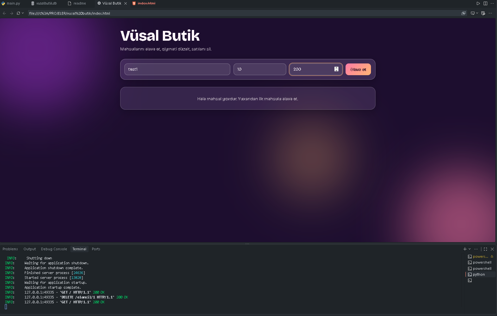
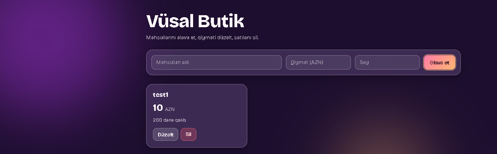
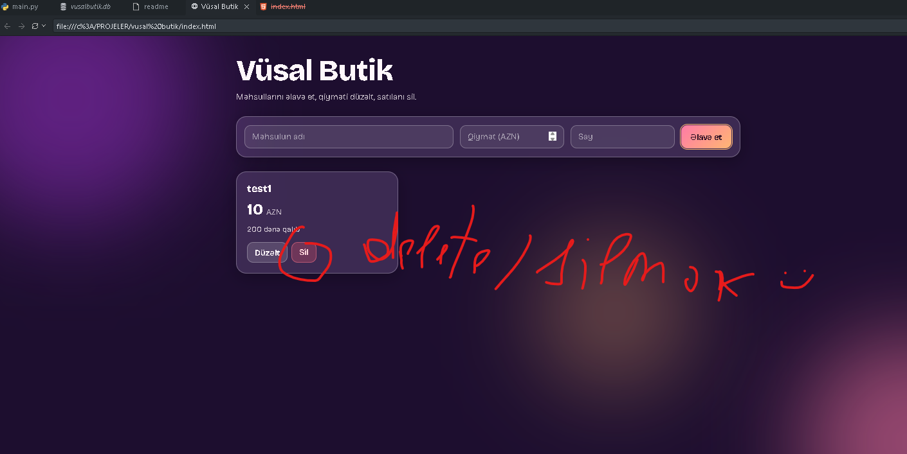

# Vüsal Butik

A small test project: an order/listing website for a fictional clothing shop called **Vüsal Butik**.

## Features

Through the website you can:

### Create a listing (name, price, stock)

Before:



After:



### Edit an existing listing


### Delete a listing



## Tech stack

- **Backend:** Python, FastAPI, SQLite (`sqlite3`)
- **Frontend:** HTML, CSS, JavaScript (single file, `index.html`)

## About the code

- I wrote the backend (`main.py`) myself.
- The frontend (`index.html`) was generated with AI. Feel free to modify it however you like.
- The website interface is in **Azerbaijani**.
- `main.py` starts with `import bcrypt`. I originally planned to add a login system, then decided against it. The import is an unused leftover: you can either delete that line or run `pip install bcrypt`.

## API endpoints

| Method | Endpoint | Description |
|--------|----------|-------------|
| GET | `/` | List all listings |
| POST | `/elanlar` | Create a new listing |
| PUT | `/deyistir/{id}` | Update a listing |
| DELETE | `/elansil/{id}` | Delete a listing |

## How to run

1. Install the dependencies:
   ```
   pip install fastapi uvicorn
   ```
2. Start the backend from the project folder:
   ```
   python -m uvicorn main:app --reload
   ```
3. Make sure the server is running (you should see `Uvicorn running on http://127.0.0.1:8000`).
4. Open `index.html` in your browser.

If you use VS Code, you can also open the file with the globe icon next to the run button, which opens it in a browser from inside the editor.

## Important note

This website is **not hosted online**. The frontend can only talk to a backend running on your own computer (`http://127.0.0.1:8000`), so the backend must be running before you open `index.html`.

The project uses SQLite, which stores data in a local file. If you want to put it online, you can modify the project and deploy the backend to a hosting service (with AI help if needed), then change the `API` constant at the top of the script in `index.html` to your server's address. For a real deployment, a hosted database such as PostgreSQL is a better choice than SQLite.
